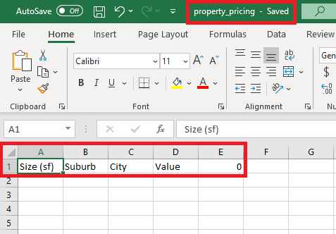
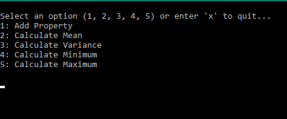
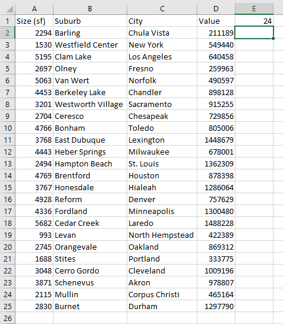
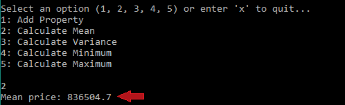
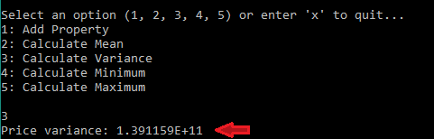
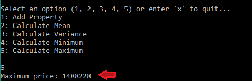

<div align="center">
    
    <p><b>MScFE 670 Data Feeds and Technology<br>
    Group Work Assignment</b><br>
    April 14, 2020</p>
    <i>
    Aaron Jones - <a href="mailto:aspcul8r@gmail.com">aspcul8r@gmail.com</a><br>
    Gustavo Campos - <a href="mailto:gustavoc82@me.com">gustavoc82@me.com</a><br>
    Mahsa Kiani - <a href="mailto:mahsa.kiani@ieee.org">mahsa.kiani@ieee.org</a><br>
    Jared Marks - <a href="mailto:jared.marks@live.com">jared.marks@live.com</a>
    </i>
    <p></p>
    <p><b>Abstract</b></p>
</div>
In this article, we explore the use of C# combined with Excel to collect and analyze data. First, we allow the user to enter the data information of properties' prices, sizes, and locations. Then, we implement basics statistical functions that allow the user to summarize the data.<br>
<p></p>
<b><i>Keywords:</i></b> C#, Excel, Data, Statistics.
<p></p>

# Introduction

This project is a command-line interface, implemented using C# and Excel, which tracks property prices. When the application is launched for the first time is to call the `SetUp` method in order to create a new Excel workbook named `property_pricing.xlsx`. The interface is implemented in a way that when the application is launched, the main method attempts to open an existing workbook; if the workbook has not been saved before in the file path, method `SetUp` is called which adds a workbook and sets it as active; then the current worksheet, sheet names, and column names are set; finally, the workbook is saved. As the visibility in the main method is set to true, an excel workbook opens, and then populates the active worksheet with specified header names. The sheet name is changed from default Sheet1 to Properties' and afterwards, it is saved as `property_pricing.xlsx`. It is important to note that in this instance, '0' is being used in order to initiate a row counter for future use.

In the second section, adding property functionality is implemented, which adds property information to the sheet. After the main method has opened an existing workbook or has run through the `SetUp` method, it opens a console screen and awaits user input. If the user enters the value of 1 (related to adding property), the main method prompts to fill four variables: size, suburb, city, and value. When the Enter key has been pressed for all prompts, the main method calls `AddPropertyToWorksheet`, and then passes the user filled variables. `AddPropertyToWorksheet` method sets the current worksheet, and then adds the property data to the table. The nrow counter variable in this method refers to the value present in row 1, cell E. Following the initial user experience described in the `SetUp` method, the nrow value is initiated to 0. For each loop of user console with the input value of '1' (related to adding property), the nrow value advances to a new row, and populates the cells based on new user input.

In the third section, four statistical methods including mean market value, variance in market value, minimum market value, and maximum market value are implemented. To demonstrate functionality, random property square footage, suburbs, cities, and values are prepopulated.

<!-- Six tasks are performed for each function. At first, the current worksheet is set as the first sheet. Then, the numbers of properties in the data `nrows` are extracted. Afterwards, it is checked whether `nrows` is greater than 0. These values are used to feed the range selection function which returns an array of objects that include the prices of the properties. Then, the values of the cells in the data range are extracted; and are put in a `List`. Finally, `System.Linq` is used to perform the required calculation and return the value. -->

# Using C# and Excel to Track Property Prices

For this submission, you will explore the use of C# and Excel to keep track of the pricing of various properties. You are required to implement various useful statistical calculations which will allow you to gain further insight into the overall trends of the property market.

You are provided with an skeleton code which includes an already implemented command-line interface, which functions according to the menu presented when the application is run:

```
Select an option (1,2,3,4,5) or enter 'x' to quit...
  1: Add Property
  2: Calculate Mean
  3: Calculate Variance
  4: Calculate Minimum
  5: Calculate Maximum
```

For this submission, complete the following tasks:

1. **Set up the worksheet when the application is launched for the first time**. The main method already calls a method `SetUp`; therefore, you simply have to implement this method, which should create a new Excel workbook titled `property_pricing.xlsx`

#### Answer

When the application is launched, the main method attempts to open an existing workbook: 

```csharp
try
{
    workbook = app.Workbooks.Open("property_pricing.xlsx", ReadOnly: false);
}
```
If the workbook has not been saved before in the file path, method `SetUp` is called:
```csharp
    catch
    {
        Setup();
    }
```

#### `Setup` Method   

```csharp
static void SetUp()
{
    // add a workbook and set it as active
    app.Workbooks.Add();
    workbook = app.ActiveWorkbook;
    // set current worksheet
    Excel._Worksheet currentSheet = workbook.Worksheets[1];
    // set sheet name
    currentSheet.Name = "Properties";
    // set columns names
    currentSheet.Cells[1, "A"] = "Size (sf)";
    currentSheet.Cells[1, "B"] = "Suburb";
    currentSheet.Cells[1, "C"] = "City";
    currentSheet.Cells[1, "D"] = "Value";
    currentSheet.Cells[1, "E"] = 0;
    // save workbook
    workbook.SaveAs("property_pricing.xlsx");
}
```

As the main method has visibility  set to true ```app.Visible=true;```, an excel workbook opens and populates the active worksheet with specified header names: Size (sf), Suburb, City, Value, and 0. The sheet name is changed from default Sheet1 to Properties and then is saved as property_pricing.xlsx. In this instance, '0' is being used to initiate a row counter for future use.



2. **Implement the adding of property information to the sheet**. The property information headers are as follows:

- Size (in square feet)
- Suburb
- City
- Market value

The command-line interface already calls a method `AddPropertyToWorksheet`, so you will simply have to implement this method.

**Note:** It will be useful here to make use of a counter, which can be stored to the right of the last header so that you have an easy reference to know how many rows of data are stored in the sheet. This will be useful for the statistical calculations, and to know where each row should be inserted when adding new rows. The counter would be a number stored in a known cell.

#### Answer

After the main method has opened an existing workbook or has run through the `SetUp` method described above, it opens a console screen and awaits user input:



When the console user enters number 1 (Add Property), the main method prompts to fill variables size, suburb, city, and value. When enter has been pressed for all prompts, the main method calls `AddPropertyToWorksheet` and passes the user filled variables.


#### `AddPropertyToWorksheet` Method

```csharp
static void AddPropertyToWorksheet(float size, string suburb, string city, float value)
{
    // set current worksheet
    Excel.Worksheet currentSheet = workbook.Worksheets[1];
            
    var nrows = currentSheet.Cells[1, "E"].value;
    nrows += 2; // need to increment since nrows above is the last FILLED row
            
    // add property data to the table 
    currentSheet.Cells[nrows, "A"] = size;
    currentSheet.Cells[nrows, "B"] = suburb;
    currentSheet.Cells[nrows, "C"] = city;
    currentSheet.Cells[nrows, "D"] = value;
    currentSheet.Cells[1, "E"] = nrows - 1;
}
```

The `nrow` counter variable refers to the value present in row 1, cell E. Following the initial user experience desribed in the `SetUp` method, the nrow value is initiated as 0. For each loop of user console input in with value '1' (Add Property), the nrow value advances to a new row and populates cells based on new user input.


3. **Implement statistical methods**. In the skeleton code you find the following four statistical methods already declared:

- Mean market value
- Variance in market value
- Minimum market value
- Maximum market value

Your task is to update these methods to perform the correct work based on the data from the sheet. These methods are already called in the command-line interface, so you only need to implement the method.

#### Answer

To demonstrate functionality we have prepopulated random property square footage, suburbs, cities, and values Let's see the table.



For each function we perform the following tasks:

- Set the first sheet as the current worksheet.
- Extract the numbers of properties in the data `nrows`.
- Check that the `nrows` is greater than 0.
- Use this value to feed the range selection function which returns an array of objects that include the prices of the properties.
- Extract the values of the cells in the data range and put it in a `List`.
- Use the `System.Linq` to perform the required calculation and return the value. 

In the following section, implementation of each function is described in more details. 

## Mean Market Value

Using the mean market value functionality, a console user is able to investigate the mean price by selecting option 2; this option calculates the mean value; choosing option 2 prompts the main method to call the `CalculateMean()` method, which utilizes the count cell defined at setup to establish the necessary range for calculation, and appends the cell values to a list before returning the mean as a float variable.

```csharp
static float CalculateMean()
{
    // set current worksheet
    Excel.Worksheet currentSheet = workbook.Worksheets[1];

    // number of properties
    var nrows = currentSheet.Cells[1, "E"].value;

    if(nrows > 0)
    {
        //This is how we get range from Excel worksheet
        var range = currentSheet.Range["D2:D" + (nrows + 1).ToString()];

        // create a list with the range values
        List<float> prices = new List<float>();
        foreach (var cell in range)
        {
            prices.Add((int)cell.Value);
        }

        // return mean
        return prices.Average();
    }

    return 0.0f;
}
```

`CalculateMean()` method sets the current worksheet, as well as the number of properties. The range from Excel worksheet is taken, and a list with the range values is created. Afterwards, the mean value of the number in the list is returned by the method.

Console output from option 2:



## Variance in Market Value

Using the variance in market value functionality, the console user could investigate the variance in market value by selecting option 3; When option 3 is selected in the application console, the main method calls the `CalculateVariance()` method, which extracts a range of cell values based on the `nrow` count before applying the variance formula.

```csharp
static float CalculateVariance()
{
    // set current worksheet
    Excel.Worksheet currentSheet = workbook.Worksheets[1];

    // number of properties
    var nrows = currentSheet.Cells[1, "E"].value;

    if (nrows > 0)
    {
        //This is how we get range from Excel worksheet
        var range = currentSheet.Range["D2:D" + (nrows + 1).ToString()];

        // create a list with the range values
        List<float> prices = new List<float>();
        foreach (var cell in range)
        {
            prices.Add((int)cell.Value);
        }

        // return Variance
        return (float)(prices.Average(z => z * z) - Math.Pow(prices.Average(), 2));
    }

    return 0.0f;
}
```
Console Ouput Option 3:



## Minimum Market Value

Using the minimum market value functionality, the user is able to investigate the minimum value of the market. When option 4 is selected, the main Method calls the `CalculateMinimum()` method and the same applicable range of property value cells is selected based on `nrows` from which values are appended to an internal list. Afterwards, the internal C# function called `Min()` is used to return the minimum value.

```csharp
static float CalculateMinimum()
{
    // set current worksheet
    Excel.Worksheet currentSheet = workbook.Worksheets[1];

    // number of properties
    var nrows = currentSheet.Cells[1, "E"].value;

    if (nrows > 0)
    {
        //This is how we get range from Excel worksheet
        var range = currentSheet.Range["D2:D" + (nrows + 1).ToString()];

        // create a list with the range values
        List<float> prices = new List<float>();
        foreach (var cell in range)
        {
            prices.Add((int)cell.Value);
        }

        // return min
        return prices.Min();
    }

    return 0.0f;
}
```

Console Output Option 4:


## Maximum Market Value

Lastly, using the maximum market value functionality, the console user could investigate the maximum value of the market. When option 5 is selected by the user,  the main method calls the `CalculateMaximum()` method, which refers to `nrows`, extracts the applicable values of the property value cells, and appends the values to an internal list;  afterwards, it calls `Max()` function to compute the maximum value presented on the worksheet.

```csharp
static float CalculateMaximum()
{
    // set current worksheet
    Excel.Worksheet currentSheet = workbook.Worksheets[1];

    // number of properties
    var nrows = currentSheet.Cells[1, "E"].value;

    if (nrows > 0)
    {
        //This is how we get range from Excel worksheet
        var range = currentSheet.Range["D2:D" + (nrows + 1).ToString()];

        // create a list with the range values
        List<float> prices = new List<float>();
        foreach (var cell in range)
        {
            prices.Add((int)cell.Value);
        }

        // return max
        return prices.Max();
    }

    return 0.0f;
}
```
Console Output Option 5:



# Conclusion

A command-line interface is implemented using C# and Excel; the program enables the console user to track the property prices. Four statistical methods, including mean market value, variance in market value, minimum market value, and maximum market value, are implemented. Using the implemented interface, the user is able to add a property, and compute mean, variance, minimum, and maximum. 

# References

Docs.microsoft.com. (2020). System.Linq Namespace. [online] Available at:
https://docs.microsoft.com/en-us/dotnet/api/system.linq?view=netframework-4.8

Docs.microsoft.com. (2020). Microsoft.Office.Interop.Excel Namespace. [online] Available at:
https://docs.microsoft.com/en-us/dotnet/api/microsoft.office.interop.excel?view=excel-pia


